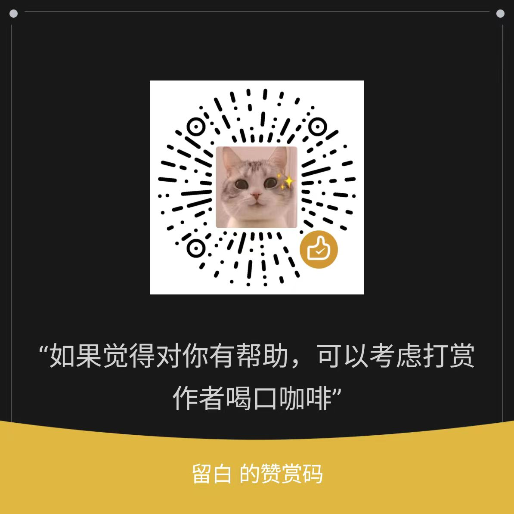

[//]: # (
)

[//]: # (  </img>)
  
<strong>ChatPDF</strong> Unlocking Knowledge with a LLM PDF Q&A Bot

  English | [简体中文](README_CN.md)

## How it worked?
Drag and drop your PDF, ask away, embark on a smart Q&A journey!

## Features
- :muscle: Powerful: Harness the power of OpenAI's large language models to extract precise and comprehensive answers from your PDFs.
- :seedling: Convenient: Simply upload your PDF and ask your question, and our AI will do the rest.
- :mechanical_arm: Intelligent: Seamlessly converse in English, generating contextually relevant and logical responses.
- :nerd_face: Efficient: Experience swift and fluid Q&A interactions thanks to our optimized vectorization search technology.

## It's you?
- Learning Material Retrieval: Quickly access knowledge points from textbooks, research papers, and other learning resources.
- Document Comprehension: Effortlessly grasp the contents of contracts, reports, and other documents.
- Information Retrieval: Efficiently locate specific information within PDF documents.

## :partying_face: Snapshots

[//]: # (### Supported LLMs)

[//]: # ()
[//]: # (| Model             | Web Access  | API         | Notes |)

[//]: # (|-------------------| ----------- | ----------- |-------|)

[//]: # (| [gpt-3.5-turbo]&#40;&#41; | Yes         | Yes         |       |)

[//]: # ()
[//]: # (More is coming. )

What are you waiting for? Experience the convenience of smart Q&A now!

## :hammer_and_wrench: Using ChatPDF

> Environment Requirements:
> - Have available LLMs accounts and api keys.
> - Having a reliable network to access the LLMs API.

1. Configure the GPT API Key and change the `OPENAI_API_KEY` field value in the `.env`
2. Install, run `pip install -r requirements.txt`
3. Run `python main.py`

[//]: # (## Contributors)

[//]: # ()
[//]: # (<a href="https://github.com/nathanyun/chatpdf/graphs/contributors">)

[//]: # (  )

[//]: # (</a>)

## :baby: About me
（Please contact me if you have any questions or ideas）
- Wechat：406811520 
- Email：nasheng.yun@gmail.com

## :heart: Donate 
If you found the code examples helpful, __please give me a :star: ! Thank you!__

[//]: # (#### :coffee: A penny is love)

[//]: # ()
