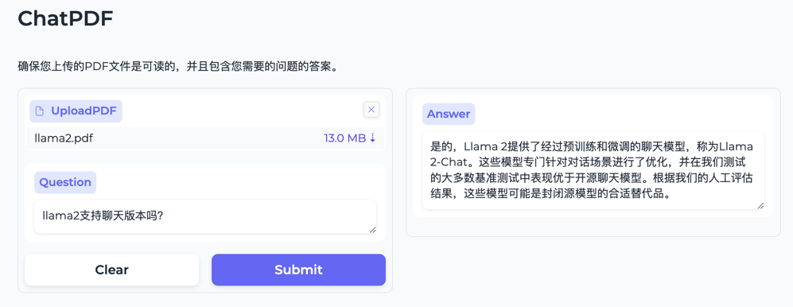

[//]: # (  </img>)
  
<strong>ChatPDF</strong> 利用大语言模型构建的 PDF 问答机器人 

  [English](README.md) | 简体中文

## 简介

将您的PDF文件拖拽到界面中，输入您的问题，即可开始智能问答之旅！

### 功能亮点

- :muscle: 强大: 基于OpenAI大语言模型，拥有强大的文本理解和生成能力，可为您提供准确、详实的答案。
- :seedling: 便捷: 只需上传PDF文件和输入问题，即可快速获得答案，无需繁琐的操作。
- :mechanical_arm: 智能: 支持中文问答，并能根据上下文生成符合逻辑的答案。
- :nerd_face: 高效: 高效的向量化搜索技术，使问答过程更加快速流畅。

### 适用场景

- 学习资料查询：快速获取课本、论文等学习资料中的知识点。
- 文件理解：轻松掌握合同、报告等文件内容。
- 信息检索：高效查找PDF文档中的特定信息。

## :partying_face: 界面

还在等什么？快来体验智能问答的便捷吧！

## :hammer_and_wrench: 安装

> 环境要求
> - 可用的大模型账号、API Key及可用的token。
> - [Optional] 国内需科学上网:facepunch:。

1. 修改`.env`配置文件中的`OPENAI_API_KEY`  
2. 安装依赖 `pip install -r requirements.txt` 
3. 运行 `python main.py`。

## :baby: 关于我
（您有任何问题、有任何好想法都可以联系我~）
- 微信：406811520 
- 邮箱：nasheng.yun@gmail.com

## :heart: 捐赠 
如果对您有一丢丢帮助, 行行好给孩子个 :star: 吧!

#### :coffee: 一毛钱也是爱

